# Design Document

## Overview

MeetGenieAI is a comprehensive meeting assistant platform built with a microservices architecture that provides real-time meeting transcription, intelligent summarization, and interactive Q&A capabilities. The system consists of a web frontend, backend API services, real-time processing engines, and admin management tools.

## Architecture

### High-Level Architecture

```mermaid
graph TB
    subgraph "Client Layer"
        WEB[Web Dashboard]
        ADMIN[Admin Dashboard]
    end
    
    subgraph "API Gateway"
        GATEWAY[API Gateway/Load Balancer]
    end
    
    subgraph "Core Services"
        AUTH[Authentication Service]
        USER[User Management Service]
        MEETING[Meeting Service]
        TRANSCRIPT[Transcription Service]
        SUMMARY[Summarization Service]
        QA[Q&A Service]
        ADMIN_SVC[Admin Service]
        PAYMENT[Payment Service]
        BILLING[Billing Service]
    end
    
    subgraph "Real-time Processing"
        RECORDER[Meeting Recorder]
        STT[Speech-to-Text Engine]
        AI[AI Processing Engine]
        LANGCHAIN[LangChain Orchestrator]
        LANGGRAPH[LangGraph Workflows]
        LANGSMITH[LangSmith Monitor]
        INNGEST[Inngest Background Jobs]
    end
    
    subgraph "External Integrations"
        ZOOM[Zoom API]
        TEAMS[Teams API]
        MEET[Google Meet API]
        WEBEX[WebEx API]
        STRIPE[Stripe API]
        PAYPAL[PayPal API]
        GEMINI[Google Gemini Pro API]
        HUGGINGFACE[Hugging Face Inference API]
    end
    
    subgraph "Data Layer"
        POSTGRES_DB[(PostgreSQL Database)]
        SUPABASE_STORAGE[(Supabase Storage)]
        PINECONE[(Pinecone Vector DB)]
        REDIS[(Redis Cache)]
        SEARCH[(Elasticsearch)]
        CLERK_AUTH[(Clerk Authentication)]
        KAFKA[(Apache Kafka)]
    end
    
    WEB --> GATEWAY
    ADMIN --> GATEWAY
    GATEWAY --> AUTH
    GATEWAY --> USER
    GATEWAY --> MEETING
    GATEWAY --> TRANSCRIPT
    GATEWAY --> SUMMARY
    GATEWAY --> QA
    GATEWAY --> ADMIN_SVC
    GATEWAY --> PAYMENT
    GATEWAY --> BILLING
    
    MEETING --> RECORDER
    RECORDER --> STT
    STT --> LANGCHAIN
    LANGCHAIN --> LANGGRAPH
    LANGGRAPH --> AI
    AI --> SUMMARY
    AI --> QA
    LANGSMITH --> LANGCHAIN
    LANGSMITH --> LANGGRAPH
    LANGSMITH --> AI
    
    INNGEST --> SUMMARY
    INNGEST --> QA
    INNGEST --> TRANSCRIPT
    INNGEST --> BILLING
    MEETING --> INNGEST
    STT --> INNGEST
    
    RECORDER --> ZOOM
    RECORDER --> TEAMS
    RECORDER --> MEET
    RECORDER --> WEBEX
    
    AUTH --> CLERK_AUTH
    USER --> POSTGRES_DB
    MEETING --> POSTGRES_DB
    TRANSCRIPT --> POSTGRES_DB
    SUMMARY --> POSTGRES_DB
    QA --> POSTGRES_DB
    ADMIN_SVC --> POSTGRES_DB
    PAYMENT --> POSTGRES_DB
    BILLING --> POSTGRES_DB
    
    PAYMENT --> STRIPE
    PAYMENT --> PAYPAL
    BILLING --> STRIPE
    
    STT --> HUGGINGFACE
    AI --> GEMINI
    LANGCHAIN --> GEMINI
    SUMMARY --> GEMINI
    QA --> GEMINI
    
    TRANSCRIPT --> SEARCH
    SUMMARY --> SEARCH
    QA --> SEARCH
    QA --> PINECONE
    SUMMARY --> PINECONE
    TRANSCRIPT --> PINECONE
    
    RECORDER --> SUPABASE_STORAGE
    STT --> REDIS
    AI --> REDIS
    
    AUTH --> KAFKA
    USER --> KAFKA
    MEETING --> KAFKA
    TRANSCRIPT --> KAFKA
    SUMMARY --> KAFKA
    QA --> KAFKA
    PAYMENT --> KAFKA
    BILLING --> KAFKA
    ADMIN_SVC --> KAFKA
```



### Technology Stack

- **Frontend**: Next.js with TypeScript, Tailwind CSS
- **Backend**: Node.js with NestJS framework
- **Database**: PostgreSQL with Prisma ORM for structured data, Pinecone for vector search, Elasticsearch for text search
- **ORM**: Prisma for type-safe database access, migrations, and schema management
- **Authentication**: Clerk for user authentication and session management
- **File Storage**: Supabase Storage for audio files and documents
- **Cache**: Redis for real-time data and caching
- **Background Jobs**: Inngest for reliable background processing and workflows
- **Message Broker**: Apache Kafka for microservices communication and event streaming
- **Real-time Communication**: WebSockets for live transcription
- **AI/ML**: 
  - LangChain for AI orchestration with Google Gemini Pro integration
  - LangGraph for complex AI workflows and state management
  - LangSmith for monitoring and optimization
  - Google Gemini Pro 1.5 for summarization, Q&A, and natural language processing
  - Hugging Face Transformers with wav2vec2-large-960h-lv60-self model for speech-to-text transcription
  - Hugging Face Inference API for scalable model serving
  - Transformers.js for client-side AI processing when needed
- **Meeting Integration**: Platform-specific SDKs and APIs

### Database Architecture with Prisma

**Prisma Integration Strategy**:
- **Type Safety**: Prisma Client provides fully type-safe database access with TypeScript
- **Schema Management**: Prisma schema serves as single source of truth for database structure
- **Migration System**: Automated database migrations with version control
- **Connection Management**: Built-in connection pooling and optimization
- **Query Optimization**: Prisma's query engine optimizes database queries automatically
- **Multi-Service Access**: Shared Prisma client across all microservices for consistency

**Database Connection Strategy**:
- **Connection Pooling**: Prisma manages connection pools automatically
- **Health Monitoring**: Built-in database health checks and monitoring
- **Transaction Support**: ACID transactions for complex operations
- **Read Replicas**: Support for read/write splitting for scalability
- **Error Handling**: Comprehensive error handling with retry mechanisms

## Components and Interfaces

### 1. Authentication Service

**Purpose**: Handle user authentication, authorization, session management, and Clerk synchronization

**Key Interfaces**:
```typescript
interface AuthService {
  validateClerkToken(clerkToken: string): Promise<UserSession>
  syncClerkUser(clerkUser: ClerkUser): Promise<User>
  handleClerkWebhook(webhook: ClerkWebhook): Promise<void>
  getUserSession(clerkUserId: string): Promise<UserSession>
  refreshUserData(clerkUserId: string): Promise<User>
}

interface ClerkUser {
  id: string
  email_addresses: EmailAddress[]
  first_name: string
  last_name: string
  image_url?: string
  created_at: number
  updated_at: number
  last_sign_in_at?: number
}

interface ClerkWebhook {
  type: ClerkWebhookType
  data: ClerkUser
  object: string
  timestamp: number
}

interface UserSession {
  userId: string
  clerkUserId: string
  email: string
  name: string
  permissions: string[]
  subscriptionTier: SubscriptionTier
}

enum ClerkWebhookType {
  USER_CREATED = 'user.created',
  USER_UPDATED = 'user.updated',
  USER_DELETED = 'user.deleted',
  SESSION_CREATED = 'session.created',
  SESSION_ENDED = 'session.ended'
}
```

### 2. Meeting Service

**Purpose**: Manage meeting lifecycle, scheduling, and metadata

**Key Interfaces**:
```typescript
interface MeetingService {
  scheduleMeeting(meeting: MeetingSchedule): Promise<Meeting>
  joinMeeting(meetingId: string): Promise<MeetingSession>
  endMeeting(meetingId: string): Promise<MeetingSummary>
  getMeetings(userId: string, filters: MeetingFilters): Promise<Meeting[]>
}

interface Meeting {
  id: string
  title: string
  scheduledTime: Date
  duration: number
  participants: Participant[]
  platform: MeetingPlatform
  status: MeetingStatus
}

interface MeetingSession {
  meetingId: string
  sessionId: string
  recordingUrl: string
  transcriptStream: WebSocket
}
```

### 3. Transcription Service

**Purpose**: Handle real-time speech-to-text conversion and speaker identification using Hugging Face models

**Key Interfaces**:
```typescript
interface TranscriptionService {
  startTranscription(audioStream: AudioStream, config: TranscriptionConfig): Promise<TranscriptionSession>
  processAudioChunk(sessionId: string, audioChunk: Buffer): Promise<TranscriptSegment>
  identifySpeakers(audioData: Buffer): Promise<SpeakerIdentification>
  finalizeTranscript(sessionId: string): Promise<FullTranscript>
  getModelStatus(): Promise<HuggingFaceModelStatus>
  switchModel(modelName: string): Promise<void>
}

interface TranscriptionConfig {
  modelName: string // Default: "facebook/wav2vec2-large-960h-lv60-self"
  language: string
  enableSpeakerDiarization: boolean
  chunkSize: number
  overlapSize: number
  confidenceThreshold: number
}

interface HuggingFaceModelStatus {
  modelName: string
  status: 'loading' | 'ready' | 'error'
  loadTime?: number
  lastUsed?: Date
  errorMessage?: string
}

interface TranscriptSegment {
  timestamp: number
  speakerId: string
  text: string
  confidence: number
  modelUsed: string
  processingTime: number
}

interface FullTranscript {
  meetingId: string
  segments: TranscriptSegment[]
  speakers: Speaker[]
  duration: number
  modelMetadata: {
    primaryModel: string
    fallbackModelsUsed: string[]
    averageConfidence: number
    processingStats: ProcessingStats
  }
}

interface ProcessingStats {
  totalChunks: number
  averageProcessingTime: number
  modelSwitches: number
  errorCount: number
}
```

### 4. Summarization Service

**Purpose**: Generate intelligent meeting summaries with structured content using Google Gemini Pro

**Key Interfaces**:
```typescript
interface SummarizationService {
  generateSummary(transcript: FullTranscript, preferences: UserPreferences): Promise<MeetingSummary>
  extractActionItems(transcript: FullTranscript): Promise<ActionItem[]>
  identifyDecisions(transcript: FullTranscript): Promise<Decision[]>
  categorizeDiscussion(transcript: FullTranscript): Promise<DiscussionPoint[]>
  analyzeSentiment(transcript: FullTranscript): Promise<SentimentAnalysis>
  generatePersonalizedSummary(transcript: FullTranscript, userId: string): Promise<PersonalizedSummary>
  getGeminiModelStatus(): Promise<GeminiModelStatus>
}

interface GeminiModelStatus {
  modelName: string // "gemini-pro-1.5"
  status: 'available' | 'rate_limited' | 'error'
  requestsRemaining?: number
  resetTime?: Date
  lastUsed?: Date
  averageResponseTime: number
}

interface SummarizationConfig {
  modelName: string // Default: "gemini-pro-1.5"
  temperature: number // 0.0 to 1.0
  maxTokens: number
  topP: number
  topK: number
  safetySettings: GeminiSafetySettings[]
}

interface GeminiSafetySettings {
  category: 'HARM_CATEGORY_HARASSMENT' | 'HARM_CATEGORY_HATE_SPEECH' | 'HARM_CATEGORY_SEXUALLY_EXPLICIT' | 'HARM_CATEGORY_DANGEROUS_CONTENT'
  threshold: 'BLOCK_NONE' | 'BLOCK_ONLY_HIGH' | 'BLOCK_MEDIUM_AND_ABOVE' | 'BLOCK_LOW_AND_ABOVE'
}

interface MeetingSummary {
  meetingId: string
  keyPoints: DiscussionPoint[]
  actionItems: ActionItem[]
  decisions: Decision[]
  participants: ParticipantSummary[]
  sentimentAnalysis: SentimentAnalysis
  generatedAt: Date
  modelMetadata: {
    modelUsed: string
    processingTime: number
    tokenUsage: TokenUsage
    confidence: number
  }
}

interface TokenUsage {
  promptTokens: number
  completionTokens: number
  totalTokens: number
  estimatedCost: number
}

interface SentimentAnalysis {
  overallSentiment: 'positive' | 'neutral' | 'negative'
  sentimentScore: number // -1 to 1
  participantSentiments: ParticipantSentiment[]
  emotionalTone: string[]
  engagementLevel: 'high' | 'medium' | 'low'
}

interface ParticipantSentiment {
  participantId: string
  sentiment: 'positive' | 'neutral' | 'negative'
  sentimentScore: number
  dominantEmotions: string[]
}

interface ActionItem {
  description: string
  assignee: string
  dueDate?: Date
  priority: Priority
  timestamp: number
  confidence: number
  extractedBy: string // model name
  context: string // surrounding text
}
```

### 5. Q&A Service

**Purpose**: Handle natural language queries about meeting content using Google Gemini Pro

**Key Interfaces**:
```typescript
interface QAService {
  askQuestion(question: string, meetingId: string, userId: string, context?: QAContext): Promise<QAResponse>
  getQAHistory(meetingId: string): Promise<QAInteraction[]>
  searchMeetings(query: string, userId: string): Promise<SearchResult[]>
  generateFollowUpQuestions(question: string, answer: string): Promise<string[]>
  classifyQueryIntent(question: string): Promise<QueryIntent>
  expandQuery(question: string): Promise<ExpandedQuery>
  getGeminiQAStatus(): Promise<GeminiModelStatus>
}

interface QAContext {
  conversationHistory: QAInteraction[]
  userPreferences: UserPreferences
  meetingContext: MeetingContext
  timeRange?: TimeRange
}

interface MeetingContext {
  meetingType: string
  participants: string[]
  duration: number
  topics: string[]
}

interface QAResponse {
  answer: string
  confidence: number
  sources: SourceReference[]
  relatedMeetings?: string[]
  followUpQuestions: string[]
  queryIntent: QueryIntent
  modelMetadata: {
    modelUsed: string
    processingTime: number
    tokenUsage: TokenUsage
    reasoning?: string
  }
}

interface ExpandedQuery {
  originalQuery: string
  expandedTerms: string[]
  synonyms: string[]
  relatedConcepts: string[]
  searchQueries: string[]
}

interface QueryIntent {
  primaryIntent: 'factual' | 'analytical' | 'summarization' | 'action_items' | 'participants' | 'timeline'
  confidence: number
  subIntents: string[]
  suggestedActions: string[]
}

interface QAInteraction {
  id: string
  question: string
  answer: string
  timestamp: Date
  userId: string
  meetingId: string
  confidence: number
  sources: SourceReference[]
  queryIntent: QueryIntent
  followUpQuestions: string[]
  userFeedback?: UserFeedback
}

interface SourceReference {
  type: 'transcript' | 'summary' | 'action_item' | 'decision'
  meetingId: string
  timestamp?: number
  speakerId?: string
  text: string
  relevanceScore: number
  context: string
}

interface UserFeedback {
  rating: 1 | 2 | 3 | 4 | 5
  helpful: boolean
  comment?: string
  timestamp: Date
}
```

### 6. Admin Service

**Purpose**: Platform administration, user management, and system monitoring

**Key Interfaces**:
```typescript
interface AdminService {
  getUserMetrics(): Promise<UserMetrics>
  getSystemHealth(): Promise<SystemHealth>
  manageUser(userId: string, action: AdminAction): Promise<void>
  configureGlobalSettings(settings: GlobalSettings): Promise<void>
  getAuditLogs(filters: AuditFilters): Promise<AuditLog[]>
}

interface UserMetrics {
  totalUsers: number
  activeUsers: number
  meetingsProcessed: number
  storageUsed: number
}

interface SystemHealth {
  services: ServiceStatus[]
  performance: PerformanceMetrics
  alerts: SystemAlert[]
}
```

### 7. Payment Service

**Purpose**: Handle payment processing, subscription management, and billing operations

**Key Interfaces**:
```typescript
interface PaymentService {
  createSubscription(userId: string, planId: string, paymentMethod: PaymentMethod): Promise<Subscription>
  updateSubscription(subscriptionId: string, planId: string): Promise<Subscription>
  cancelSubscription(subscriptionId: string): Promise<void>
  processPayment(paymentIntent: PaymentIntent): Promise<PaymentResult>
  addPaymentMethod(userId: string, paymentMethod: PaymentMethod): Promise<void>
  getPaymentMethods(userId: string): Promise<PaymentMethod[]>
}

interface Subscription {
  id: string
  userId: string
  planId: string
  status: SubscriptionStatus
  currentPeriodStart: Date
  currentPeriodEnd: Date
  cancelAtPeriodEnd: boolean
  trialEnd?: Date
}

interface PaymentMethod {
  id: string
  type: PaymentType
  last4?: string
  brand?: string
  expiryMonth?: number
  expiryYear?: number
  isDefault: boolean
}
```

### 8. Billing Service

**Purpose**: Manage billing cycles, invoicing, and usage tracking

**Key Interfaces**:
```typescript
interface BillingService {
  generateInvoice(subscriptionId: string): Promise<Invoice>
  getInvoices(userId: string, filters: InvoiceFilters): Promise<Invoice[]>
  trackUsage(userId: string, usage: UsageRecord): Promise<void>
  getUsageReport(userId: string, period: BillingPeriod): Promise<UsageReport>
  applyPromoCode(userId: string, promoCode: string): Promise<PromoCodeResult>
  calculateTax(amount: number, location: BillingAddress): Promise<TaxCalculation>
}

interface Invoice {
  id: string
  userId: string
  subscriptionId: string
  amount: number
  tax: number
  total: number
  currency: string
  status: InvoiceStatus
  dueDate: Date
  paidAt?: Date
  items: InvoiceItem[]
}

interface UsageRecord {
  userId: string
  feature: string
  quantity: number
  timestamp: Date
  metadata?: Record<string, any>
}
```

### 9. Clerk Synchronization Service

**Purpose**: Maintain synchronization between Clerk authentication and local database user records

**Key Interfaces**:
```typescript
interface ClerkSyncService {
  syncUserFromClerk(clerkUserId: string): Promise<User>
  handleUserCreated(clerkUser: ClerkUser): Promise<User>
  handleUserUpdated(clerkUser: ClerkUser): Promise<User>
  handleUserDeleted(clerkUserId: string): Promise<void>
  validateClerkWebhook(payload: string, signature: string): boolean
  processWebhookEvent(event: ClerkWebhookEvent): Promise<void>
  getUserByClerkId(clerkUserId: string): Promise<User | null>
  createDefaultUserPreferences(): UserPreferences
}

interface ClerkWebhookEvent {
  type: ClerkWebhookType
  data: ClerkUser
  object: string
  timestamp: number
}

interface ClerkUserSync {
  clerkUserId: string
  localUserId: string
  lastSyncAt: Date
  syncStatus: SyncStatus
  syncErrors?: string[]
}

enum SyncStatus {
  SYNCED = 'synced',
  PENDING = 'pending',
  ERROR = 'error',
  DELETED = 'deleted'
}

// Clerk webhook event handlers
interface ClerkEventHandlers {
  'user.created': (user: ClerkUser) => Promise<void>
  'user.updated': (user: ClerkUser) => Promise<void>
  'user.deleted': (userId: string) => Promise<void>
  'session.created': (session: ClerkSession) => Promise<void>
  'session.ended': (session: ClerkSession) => Promise<void>
}
```

**Synchronization Strategy**:
- **Real-time Sync**: Webhook-based immediate synchronization for user changes
- **Batch Sync**: Periodic reconciliation to catch missed events
- **Conflict Resolution**: Handle cases where local and Clerk data diverge
- **Error Recovery**: Retry failed synchronizations with exponential backoff
- **Data Mapping**: Transform Clerk user data to local user schema

### 10. Prisma Database Service

**Purpose**: Provide type-safe database access, connection management, and transaction support across all microservices

**Key Interfaces**:
```typescript
interface PrismaService extends PrismaClient {
  healthCheck(): Promise<boolean>
  getHealthInfo(): Promise<DatabaseHealthInfo>
  executeTransaction<T>(fn: (prisma: PrismaClient) => Promise<T>): Promise<T>
  getConnectionPoolStatus(): Promise<ConnectionPoolStatus>
}

interface DatabaseHealthInfo {
  isHealthy: boolean
  connectionStatus: 'connected' | 'disconnected' | 'error'
  lastChecked: Date
  responseTime?: number
  error?: string
  version?: string
}

interface ConnectionPoolStatus {
  activeConnections?: number
  idleConnections?: number
  totalConnections?: number
  maxConnections?: number
  queuedRequests?: number
}

interface PrismaRepository<T> {
  create(data: Prisma.Args<T, 'create'>['data']): Promise<T>
  findUnique(where: Prisma.Args<T, 'findUnique'>['where']): Promise<T | null>
  findMany(args?: Prisma.Args<T, 'findMany'>): Promise<T[]>
  update(args: Prisma.Args<T, 'update'>): Promise<T>
  delete(where: Prisma.Args<T, 'delete'>['where']): Promise<T>
  count(args?: Prisma.Args<T, 'count'>): Promise<number>
}

// Service-specific repository interfaces
interface UserRepository extends PrismaRepository<User> {
  findByClerkId(clerkUserId: string): Promise<User | null>
  findByEmail(email: string): Promise<User | null>
  updateLastActive(userId: string): Promise<User>
  getUserWithSubscription(userId: string): Promise<UserWithSubscription | null>
}

interface MeetingRepository extends PrismaRepository<Meeting> {
  findByOrganizer(organizerId: string, filters?: MeetingFilters): Promise<Meeting[]>
  findByParticipant(userId: string, filters?: MeetingFilters): Promise<Meeting[]>
  findUpcoming(userId: string): Promise<Meeting[]>
  findWithTranscripts(meetingId: string): Promise<MeetingWithTranscripts | null>
  updateStatus(meetingId: string, status: MeetingStatus): Promise<Meeting>
}

interface TranscriptRepository extends PrismaRepository<Transcript> {
  findByMeeting(meetingId: string): Promise<Transcript[]>
  findSegmentsByTimeRange(transcriptId: string, startTime: number, endTime: number): Promise<TranscriptSegment[]>
  findBySpeaker(speakerId: string): Promise<TranscriptSegment[]>
  searchTranscripts(query: string, userId: string): Promise<TranscriptSearchResult[]>
}

interface SummaryRepository extends PrismaRepository<Summary> {
  findByMeeting(meetingId: string): Promise<Summary[]>
  findLatestVersion(meetingId: string): Promise<Summary | null>
  findActionItemsByUser(userId: string, status?: ActionItemStatus): Promise<ActionItem[]>
  findDecisionsByMeeting(meetingId: string): Promise<Decision[]>
}

interface PaymentRepository extends PrismaRepository<UserSubscription> {
  findActiveSubscription(userId: string): Promise<UserSubscription | null>
  findPaymentMethods(userId: string): Promise<PaymentMethod[]>
  findInvoices(userId: string, filters?: InvoiceFilters): Promise<Invoice[]>
  trackUsage(userId: string, usage: UsageRecord): Promise<UsageRecord>
  getUsageReport(userId: string, period: BillingPeriod): Promise<UsageReport>
}

// Prisma middleware for audit logging
interface AuditLogMiddleware {
  logCreate<T>(model: string, data: T, userId?: string): Promise<void>
  logUpdate<T>(model: string, id: string, oldData: T, newData: T, userId?: string): Promise<void>
  logDelete<T>(model: string, id: string, data: T, userId?: string): Promise<void>
}

// Transaction patterns
interface DatabaseTransaction {
  createMeetingWithParticipants(meeting: MeetingCreateInput, participants: ParticipantCreateInput[]): Promise<Meeting>
  processPaymentAndUpdateSubscription(payment: PaymentInput, subscription: SubscriptionUpdateInput): Promise<PaymentResult>
  generateSummaryWithActionItems(summary: SummaryCreateInput, actionItems: ActionItemCreateInput[]): Promise<Summary>
  syncClerkUserData(clerkUser: ClerkUser, preferences?: UserPreferences): Promise<User>
}
```

**Prisma Integration Patterns**:
- **Repository Pattern**: Encapsulate database operations with type-safe interfaces
- **Transaction Management**: Handle complex operations with ACID guarantees
- **Connection Pooling**: Optimize database connections across microservices
- **Middleware Integration**: Audit logging, performance monitoring, and error handling
- **Type Safety**: Full TypeScript integration with generated Prisma types
- **Query Optimization**: Leverage Prisma's query engine for optimal performance

### 11. LangChain AI Orchestration Service

**Purpose**: Orchestrate complex AI workflows using LangChain, LangGraph, and LangSmith

**Key Interfaces**:
```typescript
interface LangChainService {
  createWorkflow(workflowType: WorkflowType, config: WorkflowConfig): Promise<LangGraphWorkflow>
  executeWorkflow(workflowId: string, input: WorkflowInput): Promise<WorkflowResult>
  monitorWorkflow(workflowId: string): Promise<WorkflowMetrics>
  optimizeChain(chainId: string, feedback: ChainFeedback): Promise<OptimizedChain>
}

interface LangGraphWorkflow {
  id: string
  type: WorkflowType
  nodes: WorkflowNode[]
  edges: WorkflowEdge[]
  state: WorkflowState
  config: WorkflowConfig
}

interface WorkflowNode {
  id: string
  type: NodeType
  function: string
  inputs: NodeInput[]
  outputs: NodeOutput[]
  llmConfig?: LLMConfig
}

interface LangSmithMonitor {
  trackExecution(runId: string, metadata: ExecutionMetadata): Promise<void>
  logFeedback(runId: string, feedback: UserFeedback): Promise<void>
  getPerformanceMetrics(timeRange: TimeRange): Promise<PerformanceMetrics>
  analyzeChainPerformance(chainId: string): Promise<ChainAnalysis>
}

// AI Workflow Types
enum WorkflowType {
  MEETING_SUMMARIZATION = 'meeting_summarization',
  ACTION_ITEM_EXTRACTION = 'action_item_extraction',
  QA_PROCESSING = 'qa_processing',
  SPEAKER_ANALYSIS = 'speaker_analysis',
  SENTIMENT_ANALYSIS = 'sentiment_analysis'
}

enum NodeType {
  LLM_CALL = 'llm_call',
  PROMPT_TEMPLATE = 'prompt_template',
  OUTPUT_PARSER = 'output_parser',
  RETRIEVER = 'retriever',
  MEMORY = 'memory',
  TOOL = 'tool'
}
```

## Data Models

### Core Entities

```typescript
// User Management
interface User {
  id: string
  email: string
  name: string
  clerkUserId: string // Clerk user ID for synchronization
  preferences: UserPreferences
  subscription: SubscriptionTier
  createdAt: Date
  updatedAt: Date
  lastActive: Date
  clerkSyncStatus: SyncStatus
  lastClerkSyncAt?: Date
}

interface UserPreferences {
  language: string
  summaryFormat: SummaryFormat
  tone: TonePreference
  focusAreas: string[]
  notifications: NotificationSettings
}

// Meeting Data
interface Meeting {
  id: string
  title: string
  description?: string
  scheduledTime: Date
  actualStartTime?: Date
  actualEndTime?: Date
  duration: number
  platform: MeetingPlatform
  platformMeetingId: string
  organizerId: string
  participants: Participant[]
  status: MeetingStatus
  recordingUrl?: string
  transcriptId?: string
  summaryId?: string
}

interface Participant {
  userId?: string
  name: string
  email?: string
  role: ParticipantRole
  joinTime?: Date
  leaveTime?: Date
  speakingTime: number
}

// Transcript Data
interface Transcript {
  id: string
  meetingId: string
  segments: TranscriptSegment[]
  speakers: Speaker[]
  language: string
  confidence: number
  processingStatus: ProcessingStatus
  createdAt: Date
}

interface Speaker {
  id: string
  name?: string
  voiceProfile: string
  segments: number[]
}

// Summary Data
interface Summary {
  id: string
  meetingId: string
  keyPoints: DiscussionPoint[]
  actionItems: ActionItem[]
  decisions: Decision[]
  participantInsights: ParticipantInsight[]
  generatedAt: Date
  version: number
}

interface DiscussionPoint {
  topic: string
  description: string
  participants: string[]
  timestamp: number
  importance: ImportanceLevel
}

// Payment and Billing Data
interface Subscription {
  id: string
  userId: string
  planId: string
  status: SubscriptionStatus
  currentPeriodStart: Date
  currentPeriodEnd: Date
  cancelAtPeriodEnd: boolean
  trialEnd?: Date
  paymentMethodId: string
  createdAt: Date
  updatedAt: Date
}

interface SubscriptionPlan {
  id: string
  name: string
  description: string
  price: number
  currency: string
  interval: BillingInterval
  features: PlanFeature[]
  limits: PlanLimits
  isActive: boolean
}

interface PlanLimits {
  monthlyMeetings: number
  transcriptionMinutes: number
  storageGB: number
  participantsPerMeeting: number
  apiCallsPerMonth: number
}

interface Invoice {
  id: string
  userId: string
  subscriptionId: string
  amount: number
  tax: number
  total: number
  currency: string
  status: InvoiceStatus
  dueDate: Date
  paidAt?: Date
  items: InvoiceItem[]
  paymentAttempts: PaymentAttempt[]
  createdAt: Date
}

interface InvoiceItem {
  description: string
  quantity: number
  unitPrice: number
  amount: number
  period: BillingPeriod
}

interface PaymentMethod {
  id: string
  userId: string
  type: PaymentType
  provider: PaymentProvider
  last4?: string
  brand?: string
  expiryMonth?: number
  expiryYear?: number
  isDefault: boolean
  isValid: boolean
  createdAt: Date
}

interface UsageRecord {
  id: string
  userId: string
  subscriptionId: string
  feature: UsageFeature
  quantity: number
  timestamp: Date
  billingPeriod: string
  metadata?: Record<string, any>
}

// Enums for Payment System
enum SubscriptionStatus {
  ACTIVE = 'active',
  PAST_DUE = 'past_due',
  CANCELED = 'canceled',
  UNPAID = 'unpaid',
  TRIALING = 'trialing'
}

enum InvoiceStatus {
  DRAFT = 'draft',
  OPEN = 'open',
  PAID = 'paid',
  VOID = 'void',
  UNCOLLECTIBLE = 'uncollectible'
}

enum PaymentType {
  CREDIT_CARD = 'credit_card',
  DEBIT_CARD = 'debit_card',
  BANK_ACCOUNT = 'bank_account',
  PAYPAL = 'paypal'
}

enum PaymentProvider {
  STRIPE = 'stripe',
  PAYPAL = 'paypal'
}

enum BillingInterval {
  MONTHLY = 'monthly',
  YEARLY = 'yearly'
}

enum UsageFeature {
  MEETING_MINUTES = 'meeting_minutes',
  TRANSCRIPTION_MINUTES = 'transcription_minutes',
  AI_SUMMARIES = 'ai_summaries',
  QA_QUERIES = 'qa_queries',
  STORAGE_GB = 'storage_gb'
}
```

## Error Handling

### Error Categories

1. **Authentication Errors**: Invalid credentials, expired tokens, insufficient permissions
2. **Meeting Platform Errors**: Connection failures, API rate limits, unsupported features
3. **Processing Errors**: Transcription failures, AI service unavailability, audio quality issues
4. **Data Errors**: Database connection issues, data corruption, storage failures
5. **Validation Errors**: Invalid input data, missing required fields, format violations

### Error Response Format

```typescript
interface ErrorResponse {
  error: {
    code: string
    message: string
    details?: any
    timestamp: Date
    requestId: string
  }
}

// Example error codes
enum ErrorCodes {
  INVALID_CREDENTIALS = 'AUTH_001',
  TOKEN_EXPIRED = 'AUTH_002',
  MEETING_NOT_FOUND = 'MEETING_001',
  TRANSCRIPTION_FAILED = 'PROCESS_001',
  PLATFORM_UNAVAILABLE = 'PLATFORM_001',
  INSUFFICIENT_PERMISSIONS = 'AUTH_003'
}
```

### Error Handling Strategy

- **Graceful Degradation**: Continue core functionality when non-critical services fail
- **Retry Logic**: Implement exponential backoff for transient failures
- **Circuit Breaker**: Prevent cascade failures in microservices
- **Monitoring**: Real-time error tracking and alerting
- **User Communication**: Clear, actionable error messages

## Testing Strategy

### Unit Testing
- **Coverage Target**: 90% code coverage for core business logic
- **Framework**: Jest for Node.js services, React Testing Library for frontend
- **Focus Areas**: Service methods, data transformations, validation logic

### Integration Testing
- **API Testing**: Test service-to-service communication
- **Database Testing**: Verify data persistence and retrieval
- **External API Testing**: Mock meeting platform integrations

### End-to-End Testing
- **User Workflows**: Complete meeting lifecycle testing
- **Real-time Features**: WebSocket communication testing
- **Cross-browser Testing**: Ensure frontend compatibility

### Performance Testing
- **Load Testing**: Simulate concurrent meeting processing
- **Stress Testing**: Test system limits and failure points
- **Audio Processing**: Verify real-time transcription performance

### Security Testing
- **Authentication**: Test token validation and session management
- **Authorization**: Verify role-based access controls
- **Data Protection**: Test encryption and secure data handling
- **Input Validation**: Test against injection attacks and malformed data

## Security Considerations

### Data Protection
- **Encryption at Rest**: All sensitive data encrypted in database
- **Encryption in Transit**: TLS 1.3 for all API communications
- **Audio Data**: Temporary storage with automatic cleanup
- **PII Handling**: Minimal collection and secure processing

### Access Control
- **Role-Based Access**: User, Admin, and System roles
- **API Authentication**: JWT tokens with refresh mechanism
- **Meeting Access**: Participant-based authorization
- **Admin Functions**: Multi-factor authentication required

### Compliance
- **GDPR**: Data subject rights and consent management
- **CCPA**: California privacy law compliance
- **SOC 2**: Security and availability controls
- **Recording Consent**: Explicit consent for meeting recording

### Monitoring and Auditing
- **Access Logs**: All API access logged and monitored
- **Admin Actions**: Comprehensive audit trail
- **Security Events**: Real-time alerting for suspicious activity
- **Data Access**: Track all data access and modifications