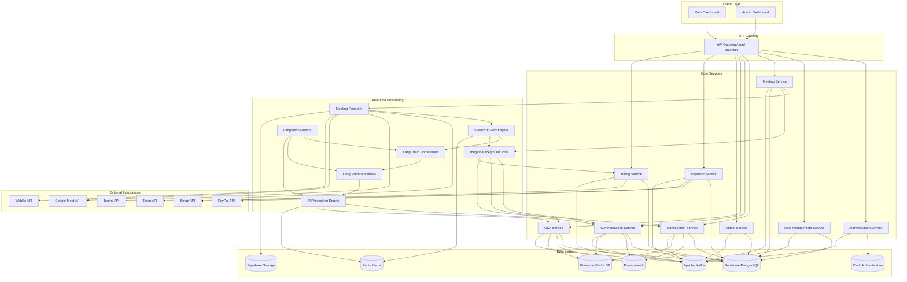

# Design Document

## Overview

MeetGenieAI is a comprehensive meeting assistant platform built with a microservices architecture that provides real-time meeting transcription, intelligent summarization, and interactive Q&A capabilities. The system consists of a web frontend, backend API services, real-time processing engines, and admin management tools.

## Architecture

### High-Level Architecture



### Technology Stack

- **Frontend**: Next.js with TypeScript, Tailwind CSS
- **Backend**: Node.js with NestJS framework
- **Database**: Supabase PostgreSQL for structured data, Pinecone for vector search, Elasticsearch for text search
- **Authentication**: Clerk for user authentication and session management
- **File Storage**: Supabase Storage for audio files and documents
- **Cache**: Redis for real-time data and caching
- **Background Jobs**: Inngest for reliable background processing and workflows
- **Message Broker**: Apache Kafka for microservices communication and event streaming
- **Real-time Communication**: WebSockets for live transcription
- **AI/ML**: LangChain for AI orchestration, LangGraph for complex workflows, LangSmith for monitoring, OpenAI GPT-4 for summarization and Q&A, Whisper for transcription
- **Meeting Integration**: Platform-specific SDKs and APIs

## Components and Interfaces

### 1. Authentication Service

**Purpose**: Handle user authentication, authorization, and session management

**Key Interfaces**:
```typescript
interface AuthService {
  login(credentials: LoginCredentials): Promise<AuthToken>
  logout(token: string): Promise<void>
  validateToken(token: string): Promise<UserSession>
  refreshToken(refreshToken: string): Promise<AuthToken>
}

interface LoginCredentials {
  email: string
  password: string
}

interface AuthToken {
  accessToken: string
  refreshToken: string
  expiresIn: number
}
```

### 2. Meeting Service

**Purpose**: Manage meeting lifecycle, scheduling, and metadata

**Key Interfaces**:
```typescript
interface MeetingService {
  scheduleMeeting(meeting: MeetingSchedule): Promise<Meeting>
  joinMeeting(meetingId: string): Promise<MeetingSession>
  endMeeting(meetingId: string): Promise<MeetingSummary>
  getMeetings(userId: string, filters: MeetingFilters): Promise<Meeting[]>
}

interface Meeting {
  id: string
  title: string
  scheduledTime: Date
  duration: number
  participants: Participant[]
  platform: MeetingPlatform
  status: MeetingStatus
}

interface MeetingSession {
  meetingId: string
  sessionId: string
  recordingUrl: string
  transcriptStream: WebSocket
}
```

### 3. Transcription Service

**Purpose**: Handle real-time speech-to-text conversion and speaker identification

**Key Interfaces**:
```typescript
interface TranscriptionService {
  startTranscription(audioStream: AudioStream): Promise<TranscriptionSession>
  processAudioChunk(sessionId: string, audioChunk: Buffer): Promise<TranscriptSegment>
  identifySpeakers(audioData: Buffer): Promise<SpeakerIdentification>
  finalizeTranscript(sessionId: string): Promise<FullTranscript>
}

interface TranscriptSegment {
  timestamp: number
  speakerId: string
  text: string
  confidence: number
}

interface FullTranscript {
  meetingId: string
  segments: TranscriptSegment[]
  speakers: Speaker[]
  duration: number
}
```

### 4. Summarization Service

**Purpose**: Generate intelligent meeting summaries with structured content

**Key Interfaces**:
```typescript
interface SummarizationService {
  generateSummary(transcript: FullTranscript, preferences: UserPreferences): Promise<MeetingSummary>
  extractActionItems(transcript: FullTranscript): Promise<ActionItem[]>
  identifyDecisions(transcript: FullTranscript): Promise<Decision[]>
  categorizeDiscussion(transcript: FullTranscript): Promise<DiscussionPoint[]>
}

interface MeetingSummary {
  meetingId: string
  keyPoints: DiscussionPoint[]
  actionItems: ActionItem[]
  decisions: Decision[]
  participants: ParticipantSummary[]
  generatedAt: Date
}

interface ActionItem {
  description: string
  assignee: string
  dueDate?: Date
  priority: Priority
  timestamp: number
}
```

### 5. Q&A Service

**Purpose**: Handle natural language queries about meeting content

**Key Interfaces**:
```typescript
interface QAService {
  askQuestion(question: string, meetingId: string, userId: string): Promise<QAResponse>
  getQAHistory(meetingId: string): Promise<QAInteraction[]>
  searchMeetings(query: string, userId: string): Promise<SearchResult[]>
}

interface QAResponse {
  answer: string
  confidence: number
  sources: SourceReference[]
  relatedMeetings?: string[]
}

interface QAInteraction {
  question: string
  answer: string
  timestamp: Date
  userId: string
}
```

### 6. Admin Service

**Purpose**: Platform administration, user management, and system monitoring

**Key Interfaces**:
```typescript
interface AdminService {
  getUserMetrics(): Promise<UserMetrics>
  getSystemHealth(): Promise<SystemHealth>
  manageUser(userId: string, action: AdminAction): Promise<void>
  configureGlobalSettings(settings: GlobalSettings): Promise<void>
  getAuditLogs(filters: AuditFilters): Promise<AuditLog[]>
}

interface UserMetrics {
  totalUsers: number
  activeUsers: number
  meetingsProcessed: number
  storageUsed: number
}

interface SystemHealth {
  services: ServiceStatus[]
  performance: PerformanceMetrics
  alerts: SystemAlert[]
}
```

### 7. Payment Service

**Purpose**: Handle payment processing, subscription management, and billing operations

**Key Interfaces**:
```typescript
interface PaymentService {
  createSubscription(userId: string, planId: string, paymentMethod: PaymentMethod): Promise<Subscription>
  updateSubscription(subscriptionId: string, planId: string): Promise<Subscription>
  cancelSubscription(subscriptionId: string): Promise<void>
  processPayment(paymentIntent: PaymentIntent): Promise<PaymentResult>
  addPaymentMethod(userId: string, paymentMethod: PaymentMethod): Promise<void>
  getPaymentMethods(userId: string): Promise<PaymentMethod[]>
}

interface Subscription {
  id: string
  userId: string
  planId: string
  status: SubscriptionStatus
  currentPeriodStart: Date
  currentPeriodEnd: Date
  cancelAtPeriodEnd: boolean
  trialEnd?: Date
}

interface PaymentMethod {
  id: string
  type: PaymentType
  last4?: string
  brand?: string
  expiryMonth?: number
  expiryYear?: number
  isDefault: boolean
}
```

### 8. Billing Service

**Purpose**: Manage billing cycles, invoicing, and usage tracking

**Key Interfaces**:
```typescript
interface BillingService {
  generateInvoice(subscriptionId: string): Promise<Invoice>
  getInvoices(userId: string, filters: InvoiceFilters): Promise<Invoice[]>
  trackUsage(userId: string, usage: UsageRecord): Promise<void>
  getUsageReport(userId: string, period: BillingPeriod): Promise<UsageReport>
  applyPromoCode(userId: string, promoCode: string): Promise<PromoCodeResult>
  calculateTax(amount: number, location: BillingAddress): Promise<TaxCalculation>
}

interface Invoice {
  id: string
  userId: string
  subscriptionId: string
  amount: number
  tax: number
  total: number
  currency: string
  status: InvoiceStatus
  dueDate: Date
  paidAt?: Date
  items: InvoiceItem[]
}

interface UsageRecord {
  userId: string
  feature: string
  quantity: number
  timestamp: Date
  metadata?: Record<string, any>
}
```

### 9. LangChain AI Orchestration Service

**Purpose**: Orchestrate complex AI workflows using LangChain, LangGraph, and LangSmith

**Key Interfaces**:
```typescript
interface LangChainService {
  createWorkflow(workflowType: WorkflowType, config: WorkflowConfig): Promise<LangGraphWorkflow>
  executeWorkflow(workflowId: string, input: WorkflowInput): Promise<WorkflowResult>
  monitorWorkflow(workflowId: string): Promise<WorkflowMetrics>
  optimizeChain(chainId: string, feedback: ChainFeedback): Promise<OptimizedChain>
}

interface LangGraphWorkflow {
  id: string
  type: WorkflowType
  nodes: WorkflowNode[]
  edges: WorkflowEdge[]
  state: WorkflowState
  config: WorkflowConfig
}

interface WorkflowNode {
  id: string
  type: NodeType
  function: string
  inputs: NodeInput[]
  outputs: NodeOutput[]
  llmConfig?: LLMConfig
}

interface LangSmithMonitor {
  trackExecution(runId: string, metadata: ExecutionMetadata): Promise<void>
  logFeedback(runId: string, feedback: UserFeedback): Promise<void>
  getPerformanceMetrics(timeRange: TimeRange): Promise<PerformanceMetrics>
  analyzeChainPerformance(chainId: string): Promise<ChainAnalysis>
}

// AI Workflow Types
enum WorkflowType {
  MEETING_SUMMARIZATION = 'meeting_summarization',
  ACTION_ITEM_EXTRACTION = 'action_item_extraction',
  QA_PROCESSING = 'qa_processing',
  SPEAKER_ANALYSIS = 'speaker_analysis',
  SENTIMENT_ANALYSIS = 'sentiment_analysis'
}

enum NodeType {
  LLM_CALL = 'llm_call',
  PROMPT_TEMPLATE = 'prompt_template',
  OUTPUT_PARSER = 'output_parser',
  RETRIEVER = 'retriever',
  MEMORY = 'memory',
  TOOL = 'tool'
}
```

## Data Models

### Core Entities

```typescript
// User Management
interface User {
  id: string
  email: string
  name: string
  preferences: UserPreferences
  subscription: SubscriptionTier
  createdAt: Date
  lastActive: Date
}

interface UserPreferences {
  language: string
  summaryFormat: SummaryFormat
  tone: TonePreference
  focusAreas: string[]
  notifications: NotificationSettings
}

// Meeting Data
interface Meeting {
  id: string
  title: string
  description?: string
  scheduledTime: Date
  actualStartTime?: Date
  actualEndTime?: Date
  duration: number
  platform: MeetingPlatform
  platformMeetingId: string
  organizerId: string
  participants: Participant[]
  status: MeetingStatus
  recordingUrl?: string
  transcriptId?: string
  summaryId?: string
}

interface Participant {
  userId?: string
  name: string
  email?: string
  role: ParticipantRole
  joinTime?: Date
  leaveTime?: Date
  speakingTime: number
}

// Transcript Data
interface Transcript {
  id: string
  meetingId: string
  segments: TranscriptSegment[]
  speakers: Speaker[]
  language: string
  confidence: number
  processingStatus: ProcessingStatus
  createdAt: Date
}

interface Speaker {
  id: string
  name?: string
  voiceProfile: string
  segments: number[]
}

// Summary Data
interface Summary {
  id: string
  meetingId: string
  keyPoints: DiscussionPoint[]
  actionItems: ActionItem[]
  decisions: Decision[]
  participantInsights: ParticipantInsight[]
  generatedAt: Date
  version: number
}

interface DiscussionPoint {
  topic: string
  description: string
  participants: string[]
  timestamp: number
  importance: ImportanceLevel
}

// Payment and Billing Data
interface Subscription {
  id: string
  userId: string
  planId: string
  status: SubscriptionStatus
  currentPeriodStart: Date
  currentPeriodEnd: Date
  cancelAtPeriodEnd: boolean
  trialEnd?: Date
  paymentMethodId: string
  createdAt: Date
  updatedAt: Date
}

interface SubscriptionPlan {
  id: string
  name: string
  description: string
  price: number
  currency: string
  interval: BillingInterval
  features: PlanFeature[]
  limits: PlanLimits
  isActive: boolean
}

interface PlanLimits {
  monthlyMeetings: number
  transcriptionMinutes: number
  storageGB: number
  participantsPerMeeting: number
  apiCallsPerMonth: number
}

interface Invoice {
  id: string
  userId: string
  subscriptionId: string
  amount: number
  tax: number
  total: number
  currency: string
  status: InvoiceStatus
  dueDate: Date
  paidAt?: Date
  items: InvoiceItem[]
  paymentAttempts: PaymentAttempt[]
  createdAt: Date
}

interface InvoiceItem {
  description: string
  quantity: number
  unitPrice: number
  amount: number
  period: BillingPeriod
}

interface PaymentMethod {
  id: string
  userId: string
  type: PaymentType
  provider: PaymentProvider
  last4?: string
  brand?: string
  expiryMonth?: number
  expiryYear?: number
  isDefault: boolean
  isValid: boolean
  createdAt: Date
}

interface UsageRecord {
  id: string
  userId: string
  subscriptionId: string
  feature: UsageFeature
  quantity: number
  timestamp: Date
  billingPeriod: string
  metadata?: Record<string, any>
}

// Enums for Payment System
enum SubscriptionStatus {
  ACTIVE = 'active',
  PAST_DUE = 'past_due',
  CANCELED = 'canceled',
  UNPAID = 'unpaid',
  TRIALING = 'trialing'
}

enum InvoiceStatus {
  DRAFT = 'draft',
  OPEN = 'open',
  PAID = 'paid',
  VOID = 'void',
  UNCOLLECTIBLE = 'uncollectible'
}

enum PaymentType {
  CREDIT_CARD = 'credit_card',
  DEBIT_CARD = 'debit_card',
  BANK_ACCOUNT = 'bank_account',
  PAYPAL = 'paypal'
}

enum PaymentProvider {
  STRIPE = 'stripe',
  PAYPAL = 'paypal'
}

enum BillingInterval {
  MONTHLY = 'monthly',
  YEARLY = 'yearly'
}

enum UsageFeature {
  MEETING_MINUTES = 'meeting_minutes',
  TRANSCRIPTION_MINUTES = 'transcription_minutes',
  AI_SUMMARIES = 'ai_summaries',
  QA_QUERIES = 'qa_queries',
  STORAGE_GB = 'storage_gb'
}
```

## Error Handling

### Error Categories

1. **Authentication Errors**: Invalid credentials, expired tokens, insufficient permissions
2. **Meeting Platform Errors**: Connection failures, API rate limits, unsupported features
3. **Processing Errors**: Transcription failures, AI service unavailability, audio quality issues
4. **Data Errors**: Database connection issues, data corruption, storage failures
5. **Validation Errors**: Invalid input data, missing required fields, format violations

### Error Response Format

```typescript
interface ErrorResponse {
  error: {
    code: string
    message: string
    details?: any
    timestamp: Date
    requestId: string
  }
}

// Example error codes
enum ErrorCodes {
  INVALID_CREDENTIALS = 'AUTH_001',
  TOKEN_EXPIRED = 'AUTH_002',
  MEETING_NOT_FOUND = 'MEETING_001',
  TRANSCRIPTION_FAILED = 'PROCESS_001',
  PLATFORM_UNAVAILABLE = 'PLATFORM_001',
  INSUFFICIENT_PERMISSIONS = 'AUTH_003'
}
```

### Error Handling Strategy

- **Graceful Degradation**: Continue core functionality when non-critical services fail
- **Retry Logic**: Implement exponential backoff for transient failures
- **Circuit Breaker**: Prevent cascade failures in microservices
- **Monitoring**: Real-time error tracking and alerting
- **User Communication**: Clear, actionable error messages

## Testing Strategy

### Unit Testing
- **Coverage Target**: 90% code coverage for core business logic
- **Framework**: Jest for Node.js services, React Testing Library for frontend
- **Focus Areas**: Service methods, data transformations, validation logic

### Integration Testing
- **API Testing**: Test service-to-service communication
- **Database Testing**: Verify data persistence and retrieval
- **External API Testing**: Mock meeting platform integrations

### End-to-End Testing
- **User Workflows**: Complete meeting lifecycle testing
- **Real-time Features**: WebSocket communication testing
- **Cross-browser Testing**: Ensure frontend compatibility

### Performance Testing
- **Load Testing**: Simulate concurrent meeting processing
- **Stress Testing**: Test system limits and failure points
- **Audio Processing**: Verify real-time transcription performance

### Security Testing
- **Authentication**: Test token validation and session management
- **Authorization**: Verify role-based access controls
- **Data Protection**: Test encryption and secure data handling
- **Input Validation**: Test against injection attacks and malformed data

## Security Considerations

### Data Protection
- **Encryption at Rest**: All sensitive data encrypted in database
- **Encryption in Transit**: TLS 1.3 for all API communications
- **Audio Data**: Temporary storage with automatic cleanup
- **PII Handling**: Minimal collection and secure processing

### Access Control
- **Role-Based Access**: User, Admin, and System roles
- **API Authentication**: JWT tokens with refresh mechanism
- **Meeting Access**: Participant-based authorization
- **Admin Functions**: Multi-factor authentication required

### Compliance
- **GDPR**: Data subject rights and consent management
- **CCPA**: California privacy law compliance
- **SOC 2**: Security and availability controls
- **Recording Consent**: Explicit consent for meeting recording

### Monitoring and Auditing
- **Access Logs**: All API access logged and monitored
- **Admin Actions**: Comprehensive audit trail
- **Security Events**: Real-time alerting for suspicious activity
- **Data Access**: Track all data access and modifications